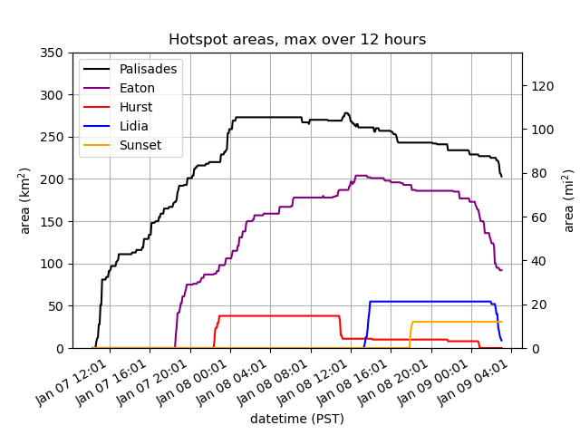
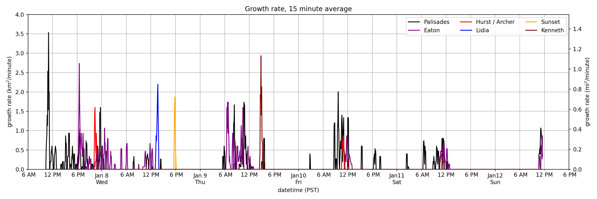

https://github.com/user-attachments/assets/0daff187-9009-4af8-8333-d12b1ce6c888

3.9 micron data from the GOES-16 East and GOES-18 West satellites on the January 2025 Southern California fires.
We download the reprojected data from UW SSEC's [RealEarth program](https://realearth.ssec.wisc.edu/).
Each image is 128x128 pixels, centered at (34.1, -118.4). Each pixel is 1.0 km.
The fires sometimes disappear from view due to cloud cover.

The code combines the two satellites' data for increased resolution.
It currently measures the areas of hotspots. 
If I have more time I might try doing some other measurements,
but I also wrote in a hurry this to demonstrate the accessibility of citizen science.

If you want to play with the code online,
one way is to import this repository onto [Google Colab](https://colab.research.google.com/).
Change the parameters of `download.py` to import new data,
and perform the analysis with `analysis.ipynb`.

